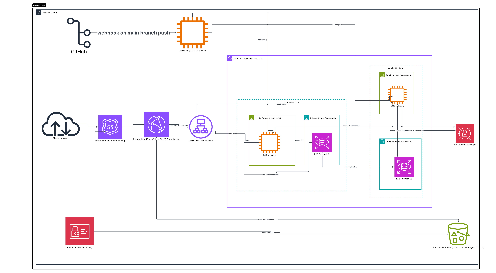
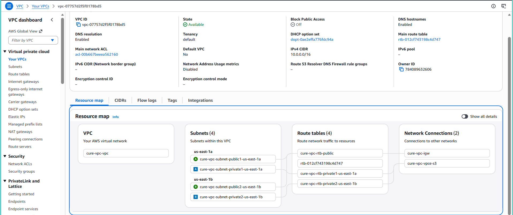
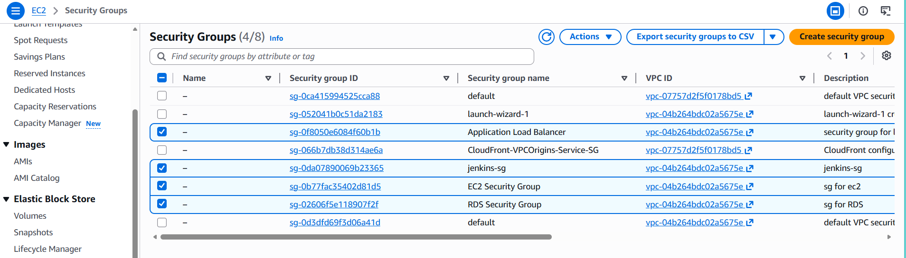
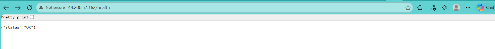
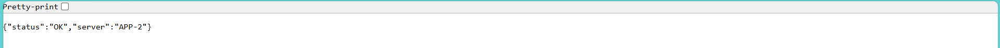
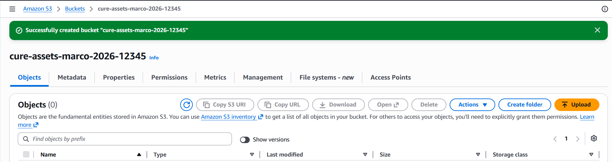
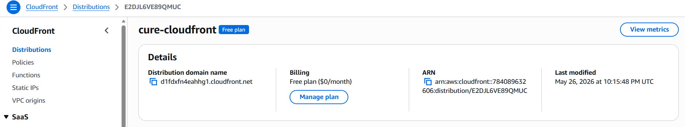
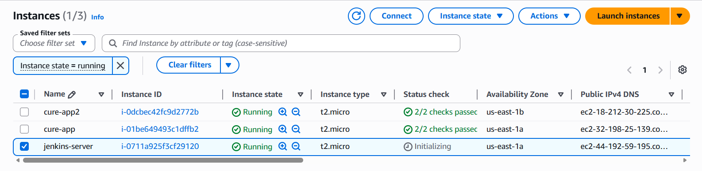
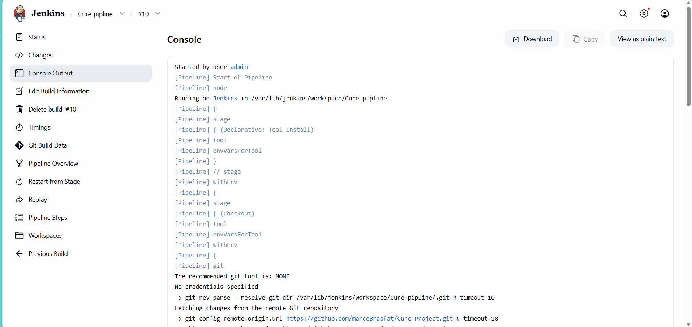
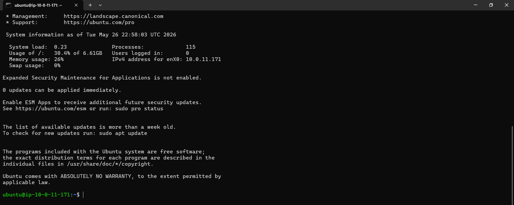

# CURE Cloud & DevOps Engineering Project

# Distributed Digital Health Infrastructure on AWS

The objective of this project was to design, deploy, secure, and automate a production-ready cloud-native infrastructure for CURE, a smart Egyptian healthcare platform that connects patients with certified home-care nurses using AWS cloud technologies, CI/CD pipelines, Infrastructure as Code, and production-ready DevOps practices.

---

# Project Objectives

This project demonstrates:

- High Availability Cloud Infrastructure
- Secure Network Isolation
- CI/CD Automation using Jenkins
- Infrastructure as Code using Terraform
- Reverse Proxy Architecture
- Load Balancing & Traffic Distribution
- CDN & HTTPS Delivery
- IAM Security Best Practices
- Production-Ready DevOps Workflows

---

# Final Architecture Design

The following diagram illustrates the final deployed cloud architecture:



---

# Architecture Overview

The infrastructure follows a modern distributed cloud architecture:

```text
Users
   ↓
CloudFront CDN
   ↓
Application Load Balancer (ALB)
   ↓
EC2 Backend Instances
   ↓
Node.js Application
   ↓
S3 / Database Layer
```

### Why This Architecture Fits CURE:

CURE is a healthcare platform that requires:
- Continuous uptime
- Fast response times
- Secure patient data handling
- High availability
- Scalability during traffic spikes
- Reliable deployment pipelines

Healthcare systems cannot tolerate:
- Long downtime
- Slow response
- Security vulnerabilities
- Single points of failure

---

# AWS Services Used & Architectural Decisions

---

# 1. VPC (Virtual Private Cloud)

## Why I Used a Custom VPC

Instead of using AWS's default VPC, I created a custom VPC to simulate a real enterprise production environment.

### Benefits:
- Full control over networking
- Better security isolation
- Controlled routing
- Scalable subnet architecture
- Cleaner infrastructure management

### Network Design:
- Public Subnet 1
- Private Subnet 1
- Public Subnet 2
- Private Subnet2

### Why This Matters in Production

In healthcare systems, network isolation is critical because backend systems and databases must remain protected from direct internet exposure.

Custom VPCs allow:
- Isolation of backend resources
- Controlled traffic routing
- Layered security implementation

---

## VPC Architecture



---

# 2. Security Groups

## Why I Used Security Groups

Security Groups act as AWS virtual firewalls.

I configured separate security groups for:

- Application Load Balancer
- EC2 APP Instances
- Jenkins Instance
- RDS 

### Security Rules Implemented

### ALB Security Group
- HTTP/HTTPS allowed from internet

### EC2 Security Group
- HTTP traffic allowed ONLY from ALB
- SSH restricted to administrator IP only

### Jenkins Security Group
- SSH access from administrator IP only SSH 22
- Jenkins Dashboard Access 8080

### RDS Security Group
-  PostgreSQL access from EC2 security group only
---

This creates:
- Better attack surface reduction
- Controlled traffic filtering
- Improved infrastructure security

---

## Security Groups



---

# 3. EC2 Backend Infrastructure

## Why I Used EC2

EC2 provides scalable cloud compute resources for backend applications.

### Benefits:
- Full server-level control
- Flexible Node.js deployment
- Easy scaling
- Free-tier eligible
- Compatible with Terraform automation

---

## Why I Used Ubuntu Instead of Amazon Linux

I selected Ubuntu because:

- Better familiarity with Ubuntu package management
- Easier Node.js ecosystem setup
- Large developer community
- Simpler debugging and package support

Ubuntu also integrates very well with:
- Nginx
- PM2
- Node.js
- Jenkins

---

## Why I Used Two EC2 Instances

Two backend servers were deployed:

- cure-app
- cure-app2

### Why?

This demonstrates:
- High Availability
- Fault Tolerance
- Horizontal Scaling
- Load Balancing functionality

If one server fails, the second server continues serving traffic.

This architecture is essential in healthcare systems where downtime must be minimized.

---

## EC2 Application Server 1



---

## EC2 Application Server 2



---

# 4. Application Load Balancer (ALB)

## Why I Used an ALB

The Application Load Balancer distributes incoming traffic between backend servers.

### Benefits:
- High Availability
- Automatic Traffic Distribution
- Health Checks
- Fault Tolerance
- Scalability

---

## Why ALB Instead of Direct EC2 Access

Without ALB:
- Users connect directly to a single server
- Single point of failure exists

With ALB:
- Traffic is balanced automatically
- Failed instances are ignored
- Infrastructure becomes resilient

---

## Why ALB Is Critical for Healthcare Systems

Healthcare applications require:
- Continuous uptime
- Stable traffic handling
- Redundancy

ALB helps maintain service continuity during server failures.

---

# Load Balancing Demonstration

[Load Balancing Between EC2 Instances](Screenshots/loadbalancing-between-cure1,2-video.mp4)

---

# 5. S3 Object Storage

## Why I Used S3

S3 was used for secure object storage.

### Features Enabled:
- Versioning
- Block Public Access
- IAM-controlled access

---

## Why S3 Instead of Local EC2 Storage

Local EC2 storage is temporary and tied to a single server.

S3 provides:
- Highly durable storage
- Better scalability
- Centralized asset management
- Easier backup handling

---

## Why Versioning Was Enabled

Versioning protects against:
- Accidental file deletion
- Overwriting important assets

This is especially important in healthcare systems where records and assets must be protected.

---

## S3 Bucket



---

# 6. CloudFront CDN

## Why I Used CloudFront

CloudFront was placed in front of the ALB.

### Benefits:
- Global CDN caching
- HTTPS edge delivery
- Reduced latency
- Improved performance

---

## Why CloudFront Instead of Direct ALB Access

Without CloudFront:
- All traffic hits ALB directly
- Higher latency
- No edge caching

With CloudFront:
- Faster global delivery
- Better user experience
- Improved scalability
- Reduced backend load

---

## Why CloudFront Is Important for Healthcare Platforms

Healthcare systems may serve users across multiple regions.

CloudFront improves:
- Speed
- Availability
- Secure HTTPS delivery
- DDoS resistance

---

## CloudFront Distribution



---

# CloudFront Output Test

[CloudFront Test Video](Screenshots/Test-cloudfront-output-video.mp4)

---

# 7. Database Design Decision

### Why PostgreSQL?

PostgreSQL is commonly preferred in enterprise systems because:

- Better ACID compliance
- Stronger data integrity
- More advanced querying
- Better scalability
- Strong support for structured healthcare data

---

## Why PostgreSQL Fits Healthcare Systems Better

Healthcare systems manage sensitive and relational data such as:

- Patients
- Medical records
- Appointments
- Transactions

PostgreSQL provides:
- Better relational consistency
- Advanced indexing
- JSON support
- Transaction reliability

---

## Why RDS Was Planned

Amazon RDS provides:
- Managed backups
- Automatic patching
- Easier scaling
- Improved reliability

Using managed databases reduces operational complexity.

---

# 8. Jenkins CI/CD Pipeline

## Why I Used Jenkins
This CI/CD provides:
- Faster deployments
- Reduced human error
- Automated delivery
- Production consistency

### CI/CD Workflow:
1. Push code to GitHub
2. Jenkins triggered automatically
3. Pull latest code
4. Install dependencies
5. Build application
6. Deploy to EC2
7. Restart PM2 service

---
---

## Jenkins EC2 Instance



---

## Jenkins Pipeline Output



---

## Jenkins SSH Connectivity



---

# CI/CD Pipeline Workflow

```text
GitHub Push
      ↓
GitHub Webhook
      ↓
Jenkins Pipeline
      ↓
Build & Test
      ↓
SSH Deployment
      ↓
PM2 Restart
```

---

# 9. Terraform Infrastructure as Code

## Why I Used Terraform

Terraform automates infrastructure provisioning.

### Benefits:
- Infrastructure reproducibility
- Version-controlled infrastructure
- Automation
- Reduced manual configuration errors

---

# 10. Security Hardening

## Security Implementations

The infrastructure includes:

- IAM role-based permissions
- Restricted SSH access
- HTTPS through CloudFront
- Security group isolation
- Nginx security headers
- Blocked public S3 access
- Least privilege architecture

---

# Repository Structure

```bash
Cure-Project/
│
├── app/
│   ├── app.js
│   ├── package.json
│
├── terraform/
│   ├── main.tf
│   ├── variables.tf
│
├── jenkins/
│   └── Jenkinsfile
│
├── nginx/
│   └── nginx.conf
│
├── Screenshots/
│
└── README.md
```

---

# Testing & Validation

The following were tested successfully:

- EC2 backend health checks
- ALB traffic routing
- CloudFront distribution
- CI/CD automatic deployments
- SSH deployment automation
- Multi-instance load balancing

---

# Production Readiness

This project was designed using production-grade cloud principles:

- High Availability
- Secure Network Isolation
- Fault Tolerance
- Automated CI/CD
- Infrastructure as Code
- Reverse Proxy Architecture
- CDN Edge Delivery

---

# Conclusion

This project successfully demonstrates a modern cloud-native DevOps architecture using AWS cloud technologies and CI/CD automation.

The final infrastructure satisfies the CURE:

- Scalable backend infrastructure
- Secure networking
- Automated deployments
- Infrastructure as Code
- Enterprise cloud architecture principles
- Production-ready DevOps workflows

---

# Author

## Marco Raafat Zakaria
